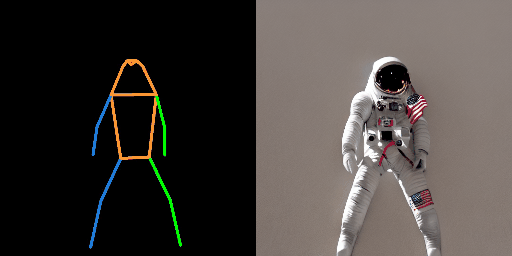

# Video Generation Reference

## Papers with code

[Text To Video](https://paperswithcode.com/task/text-to-video-generation)

## followyourpose
- https://github.com/mayuelala/followyourpose
- TL;DR: We tune the text-to-image model (e.g., stable diffusion) to generate the character videos from pose and text description.

## Tune-A-Video
-https://github.com/showlab/Tune-A-Video
- Given a video-text pair as input, our method, Tune-A-Video, fine-tunes a pre-trained text-to-image diffusion model for text-to-video generation.

## Text2Video-Zero

- https://github.com/picsart-ai-research/text2video-zero
Our method Text2Video-Zero enables zero-shot video generation using
(i) a textual prompt (see rows 1, 2),
(ii) a prompt combined with guidance from poses or edges (see lower right), and
(iii) Video Instruct-Pix2Pix, i.e., instruction-guided video editing (see lower left).

- Text to Video

"A cat is running on the grass"

- Text To Video with Edge Guidance

"A jelly Fish"

"arcane style"

## Thin-Plate Spline Motion Model for Image Animation

"talking head video" + image --> video

### Control Net

- https://github.com/lllyasviel/ControlNet#:~:text=ControlNet%20is%20a%20neural%20network,trainable%22%20one%20learns%20your%20condition.
- ControlNet is a neural network structure to control diffusion models by adding extra conditions.
- https://stablediffusionweb.com/ControlNet#demo

used by caliber?

### Inpainting

https://github.com/hitachinsk/FGT

### Frame Interpolation
- https://github.com/megvii-research/ECCV2022-RIFE

### Kaliber

### Talking heads:

- https://www.synthesia.io/
- https://www.deepbrain.io/
- https://elai.io/
- https://app.heygen.com/

## Image tools

### Stability Ai

- https://beta.dreamstudio.ai/
## Utils

### Audio editing
https://www.descript.com/podcasting

### Look into:

https://invideo.io/?ref=yti0mte
https://www.gling.ai/#how-it-works
